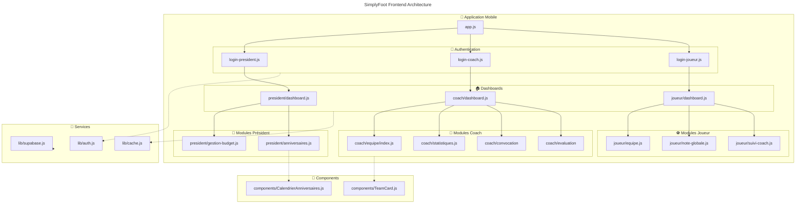

# Architecture Frontend SimplyFoot

## Diagramme d'architecture de l'application (Mermaid)



## Structure des dossiers

```
📁 SimplyFoot/
├── 📁 app/
│   ├── 📁 auth/
│   │   ├── login-president.js
│   │   ├── login-coach.js
│   │   ├── login-joueur.js
│   │   ├── inscription-president.js
│   │   ├── inscription-coach.js
│   │   └── inscription-joueur.js
│   ├── 📁 president/
│   │   ├── dashboard.js
│   │   ├── gestion-budget.js
│   │   ├── anniversaires.js
│   │   └── abonnement.js
│   ├── 📁 coach/
│   │   ├── dashboard.js
│   │   ├── creation-equipe.js
│   │   ├── statistiques.js
│   │   ├── programme-stage.js
│   │   ├── anniversaires.js
│   │   ├── 📁 equipe/
│   │   ├── 📁 joueur/
│   │   ├── 📁 convocation/
│   │   ├── 📁 composition/
│   │   ├── 📁 feuille-match/
│   │   ├── 📁 evaluation-mentale/
│   │   └── 📁 evaluation-technique/
│   └── 📁 joueur/
│       ├── dashboard.js
│       ├── equipe.js
│       ├── convocation.js
│       ├── suivi-coach.js
│       ├── note-globale.js
│       ├── eval-mentale.js
│       ├── eval-technique.js
│       ├── programme-stage.js
│       ├── anniversaires.js
│       └── 📁 nutrition/
├── 📁 lib/
│   ├── supabase.js
│   ├── auth.js
│   ├── cache.js
│   ├── notifications.js
│   └── formatDate.js
├── 📁 components/
│   ├── TeamCard.js
│   ├── NutritionScanner.js
│   └── CalendrierAnniversaires.js
└── 📁 assets/
    ├── 📁 badges/
    ├── 📁 minilogo/
    └── logo.png
```

## Flux de navigation par rôle

### 🔐 Authentification

```
Landing → [Choix rôle] → Login/Signup → Dashboard
```

### 👑 Président

```
Dashboard → Gestion Budget
         → Anniversaires
         → Abonnement
```

### 🎽 Coach

```
Dashboard → Équipes → Détail équipe → Joueur → Évaluations
         → Création équipe
         → Statistiques
         → Convocations
         → Compositions
         → Feuilles de match
         → Programme stage
         → Anniversaires
```

### ⚽ Joueur

```
Dashboard → Mon équipe
         → Convocations
         → Suivi coach
         → Note globale
         → Évaluations (lecture)
         → Programme stage
         → Anniversaires
         → Nutrition scanner
```

## Technologies utilisées

- **Framework** : React Native avec Expo
- **Navigation** : Expo Router
- **Base de données** : Supabase
- **Cache** : Custom cache system avec AsyncStorage
- **Notifications** : Expo Notifications
- **Caméra** : Expo Camera (scanner nutrition)
- **Charts** : react-native-chart-kit
- **State Management** : React Hooks + Custom cache
  class COACH_EQUIPE,COACH_EQUIPE_DETAIL,COACH_JOUEUR,COACH_CREATION,COACH_STATS,COACH_CONV,COACH_COMPO,COACH_FEUILLE,COACH_PROG,COACH_ANNIV,COACH_EVAL_MENTAL,COACH_EVAL_TECH coachStyle
  class JOUEUR_EQUIPE,JOUEUR_CONV,JOUEUR_SUIVI,JOUEUR_NOTE,JOUEUR_EVAL_MENTAL,JOUEUR_EVAL_TECH,JOUEUR_PROG,JOUEUR_ANNIV,JOUEUR_NUTRITION,JOUEUR_NUTRITION_REAL joueurStyle
  class SUPABASE,AUTH_LIB,CACHE,NOTIFICATIONS,FORMAT_DATE serviceStyle
  class TEAM_CARD,NUTRITION_SCANNER,CALENDRIER componentStyle
  class DB_USERS,DB_CLUBS,DB_EQUIPES,DB_JOUEURS,DB_STAFF,DB_EVENTS,DB_EVAL,DB_BUDGET,STORAGE dbStyle

```

## Structure des dossiers

```

📁 SimplyFoot/
├── 📁 app/
│ ├── 📁 auth/
│ │ ├── login-president.js
│ │ ├── login-coach.js
│ │ ├── login-joueur.js
│ │ ├── inscription-president.js
│ │ ├── inscription-coach.js
│ │ └── inscription-joueur.js
│ ├── 📁 president/
│ │ ├── dashboard.js
│ │ ├── gestion-budget.js
│ │ ├── anniversaires.js
│ │ └── abonnement.js
│ ├── 📁 coach/
│ │ ├── dashboard.js
│ │ ├── creation-equipe.js
│ │ ├── statistiques.js
│ │ ├── programme-stage.js
│ │ ├── anniversaires.js
│ │ ├── 📁 equipe/
│ │ ├── 📁 joueur/
│ │ ├── 📁 convocation/
│ │ ├── 📁 composition/
│ │ ├── 📁 feuille-match/
│ │ ├── 📁 evaluation-mentale/
│ │ └── 📁 evaluation-technique/
│ └── 📁 joueur/
│ ├── dashboard.js
│ ├── equipe.js
│ ├── convocation.js
│ ├── suivi-coach.js
│ ├── note-globale.js
│ ├── eval-mentale.js
│ ├── eval-technique.js
│ ├── programme-stage.js
│ ├── anniversaires.js
│ └── 📁 nutrition/
├── 📁 lib/
│ ├── supabase.js
│ ├── auth.js
│ ├── cache.js
│ ├── notifications.js
│ └── formatDate.js
├── 📁 components/
│ ├── TeamCard.js
│ ├── NutritionScanner.js
│ └── CalendrierAnniversaires.js
└── 📁 assets/
├── 📁 badges/
├── 📁 minilogo/
└── logo.png

```

## Flux de navigation par rôle

### 🔐 Authentification

```

Landing → [Choix rôle] → Login/Signup → Dashboard

```

### 👑 Président

```

Dashboard → Gestion Budget
→ Anniversaires
→ Abonnement

```

### 🎽 Coach

```

Dashboard → Équipes → Détail équipe → Joueur → Évaluations
→ Création équipe
→ Statistiques
→ Convocations
→ Compositions
→ Feuilles de match
→ Programme stage
→ Anniversaires

```

### ⚽ Joueur

```

Dashboard → Mon équipe
→ Convocations
→ Suivi coach
→ Note globale
→ Évaluations (lecture)
→ Programme stage
→ Anniversaires
→ Nutrition scanner

```

## Technologies utilisées

- **Framework** : React Native avec Expo
- **Navigation** : Expo Router
- **Base de données** : Supabase
- **Cache** : Custom cache system avec AsyncStorage
- **Notifications** : Expo Notifications
- **Caméra** : Expo Camera (scanner nutrition)
- **Charts** : react-native-chart-kit
- **State Management** : React Hooks + Custom cache
```
